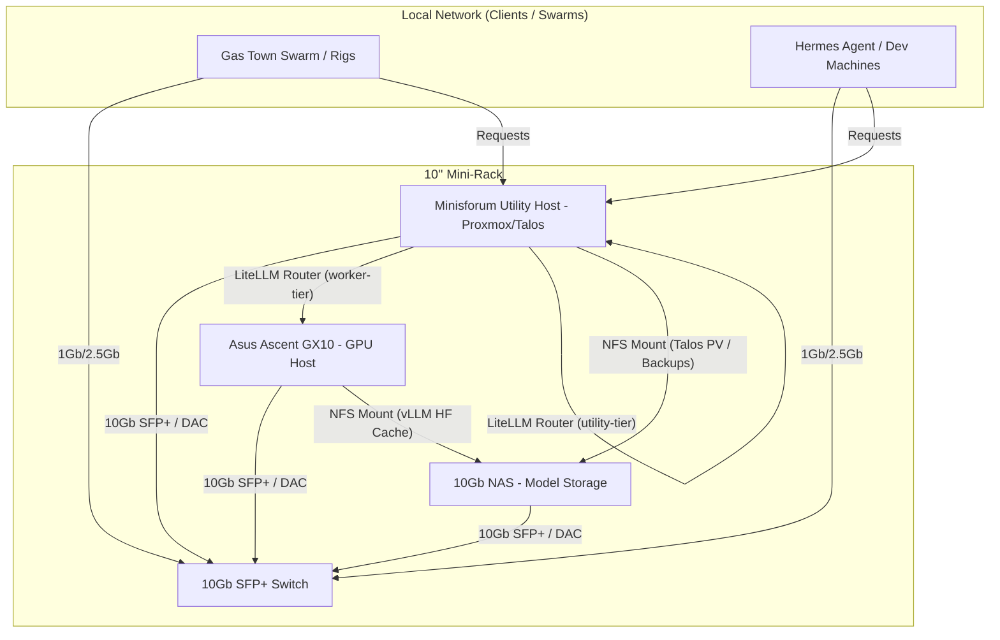

# 10" Mini-Rack local AI Cluster Design & Deployment Plan

This document details the architectural layout, component specifications, procurement checklist, and implementation steps for building and deploying a space-efficient, high-performance **10-inch mini-rack based local AI cluster**. 

By separating heavy GPU inference (Asus Ascent GX10) from utility orchestration (Minisforum utility server) and centralizing storage (TerraMaster F8-SSD Plus), this design maximizes local throughput while maintaining a minimal physical footprint.

---

## 1. System Architecture & Data Flow



---

## 2. Physical Layout & Assembly (8U Cabinet)

To achieve a clean, premium "AI Terminal Appliance" aesthetic, this design separates the cluster into a **clean Front Interaction Console** and a **functional Rear Cabling Bay**. All networking, patch panels, switch ports, power cords, and server I/O are mounted facing the rear. The front panel consists of a single custom-fitted, solid faceplate hosting only the screen, speakers, and microphone. The cabinet height is optimized to a compact **8U** layout.

### Layout Principles:
1. **1.5U Server Slots**: Both the **Asus Ascent GX10** (51 mm) and the **Minisforum MS-01** (48 mm) are housed in individual **1.5U (66.67 mm) slots** (utilizing custom 1.5U faceplates/brackets). This fits their vertical measurements perfectly with ample breathing room.
2. **Thermal Alternating Spacing**: Passive/non-active components (Patch Panel, PDU) are placed in between active, heat-producing layers (Switch, Servers, NAS) to isolate heat.
3. **Power Brick Isolation Bays**: Because the Patch Panel (7U) and the PDU (4.5U) are extremely shallow (<50 mm deep), the empty space directly behind them serves as a dedicated **Power Brick Bay** for power adapters.

### Visual Mockups (ASCII Art)

#### Front Panel View (Unified Interaction Console)
```text
+------------------------------------------+
|  +------------------------------------+  |
|  |     [  SYSTEM MONITOR CONSOLE ]    |  | <-- Flush 7" or 10" Touch LCD screen
|  |  CPU: 18%  |  GPU: 32%  |  VRAM: 8GB |  |     (Displays cluster telemetry)
|  |  Tier Route: worker-tier -> AsusGX   |  |
|  +------------------------------------+  |
|                                          |
|            [  o  o  o  o  o  ]           | <-- Far-field Microphone Array
|                                          |     (central voice capture mesh)
|                                          |
|     ( o )( o )( o )    ( o )( o )( o )   | <-- Machined Stereo Speaker Grills
|     ( o )( o )( o )    ( o )( o )( o )   |     (left and right full-range audio)
|                                          |
|  [====================================]  | <-- Front-Bottom Intake Vents / Grille
|  [====================================]  |     (air path for internal server fans)
+------------------------------------------+
```

#### Back Panel View (Rear Port & Cabling Bay - 8U Stacking with 1.5U Server Slots)
```text
+--------+---------------------------------+--------+
| [ 8U]  | [MikroTik CRS305 Switch SFP+]   | (SW)   | <-- 10G Switch (Active)
| [ 7U]  | [o] [o] [o] [o]   [o] [o] [o] [o] | (P.P)  | <-- 1U Keystone Patch Panel (Passive spacer)
| [6.5U] | [===============================] | (GPU)  | <-- Asus Ascent GX10 (Active, 1.5U slot)
| [ 5U]  | [===== Asus Ascent GX10 ========] | (GPU)  |
| [4.5U] | [ ( ) ( ) ( ) ( ) ]  [ RESET ]    | (PDU)  | <-- 1U Power Distribution Unit (Passive spacer)
| [ 4U]  | [===============================] | (UTIL) | <-- Minisforum MS-01 (Active, 1.5U slot)
| [ 3U]  | [===== Minisforum MS-01 ========] | (UTIL) |
| [ 2U]  | [=== F8-SSD Plus Rear Ports ===]  | (NAS)  | <-- TerraMaster F8-SSD Plus (Active, 2U slot)
| [ 1U]  | [================================]| (NAS)  |
+--------+---------------------------------+--------+
 (Active exhaust fans are mounted on the top roof plate pulling rising hot air upward)
```

### A. Front Panel Allocation

| Height Space | Component Panel | Panel Type | Purpose & Thermal Function |
| :--- | :--- | :--- | :--- |
| **Console Faceplate** | **Unified Console Faceplate** | Full-height custom wood/acrylic bezel | Conceals the vertical rails. Mounts touch display, speakers, microphone, and bottom intake slots. |
| **Lower Grille Slot** | **Machined Vents** | Integrated bottom slot | Allows cool ambient air to enter the front-bottom of the cabinet. |
| **Inside Chassis** | All hosts, switch, patch panels, and PDU | N/A | Secured internally behind the front face plate. |

### B. Back Panel & Interior Allocation

| Position | Component / Mount | Mount Type | Purpose & Cable Routing |
| :--- | :--- | :--- | :--- |
| **Cabinet Roof** | **Active Exhaust Fans** | Dual 120mm Top-mount Fans | Actively pulls rising hot air upward and exhausts it out the top/roof of the cabinet. |
| **Rear 8U** | **MikroTik CRS305 Switch** | 1U Custom 3D Ears (Reversed) | Central 10G SFP+ switch backplane facing the rear for easy patching. |
| **Rear 7U** | **Keystone Patch Panel** | 1U 8-Port Flush Panel | Directs house/uplink ethernet and fiber connections into the rack from the back. **Passive spacer above servers; creates upper Power Brick Bay.** |
| **Rear 5.5U - 6.5U** | **Asus Ascent GX10** | 1.5U Shelf (Reversed) | Server ports face the rear. Exposes GPU vLLM host. Fits GX10 (51 mm) perfectly. |
| **Rear 4.5U** | **PDU / Power Strip** | 1U PDU (US NEMA) | Consolidates all system power cables and blocks in the rear. **Passive spacer isolating the two servers; creates middle Power Brick Bay.** |
| **Rear 3U - 4U** | **Minisforum MS-01** | 1.5U Shelf (Reversed) | Server ports face the rear. Exposes utility server. Fits MS-01 (48 mm) perfectly. |
| **Rear 1U - 2U** | **TerraMaster F8-SSD Plus** | 2U Shelf (Reversed) | NAS ports and drive slots face the rear. Laid flat to minimize height. |
| **Interior Vertical Rails** | **Power Brick Bracket Mounts** | Zip-tie brackets in passive bays | Hides heavy power transformers for GX10, MS-01, switch, and NAS behind 7U and 4.5U lines. |

---

## 3. Hardware Checklist & Procurement

### Core Rack Components
* [ ] **12U Wall-Mount Cabinet / Open Frame**: Minimum 12U height and **at least 350 mm depth** to accommodate cable bend radii.
* [ ] **10" PDU**: 1U rackmount power strip with surge protection (minimum 10A / 1200W rating).
* [ ] **10" Patch Panel & Keystones**: 1U 8-to-12 port panel for clean cable entry.
* [ ] **Cooling**: 1U dual exhaust fan tray (or rear-mounted quiet high-static-pressure fans).

### Servers & Storage
* [ ] **GPU Host**: Asus Ascent GX10 (1.6L chassis, NVIDIA GB10 Grace Blackwell Superchip, 128GB Unified Memory).
* [ ] **Utility Host**: Minisforum MS-01 (equipped with dual 10G SFP+ ports).
* [ ] **10Gb NAS**: TerraMaster F8-SSD Plus.
  * [ ] 8x M.2 2280 NVMe SSDs (e.g. 2TB/4TB models depending on storage requirements).
* [ ] **Network Switch**: MikroTik CRS305-1G-4S+IN (10Gb SFP+).
  * [ ] 3D-printed 10" rackmount ears for CRS305.
  * [ ] 3x SFP+ DAC (Direct Attach Copper) cables (1m length).

---

## 4. Detailed Component Specifications

### A. GPU Host: Asus Ascent GX10
* **Processor**: NVIDIA GB10 Grace Blackwell Superchip (Unified CPU/GPU).
* **VRAM/RAM**: 128GB LPDDR5x unified memory (allowing local serving of massive models like Qwen2.5-Coder-32B or Llama3-70B with high context windows).
* **Storage**: 1TB PCIe Gen4 NVMe (Internal boot drive).
* **NIC**: ConnectX-7 SFP+ (Running over SFP+ transceiver/DAC to the switch at 10Gb).
* **Role**: Primary worker node running vLLM inside Docker / bare-metal.

### B. Utility Host: Minisforum MS-01 (or UM760 Slim)
* **CPU**: Intel Core i9-13900H / Ryzen 7 (depends on model selection).
* **RAM**: 64GB DDR5.
* **Storage**: Dual 2TB NVMe SSDs in RAID 1.
* **NIC**: Dual 10G SFP+ ports (integrated in MS-01).
* **Role**: K8s Control Plane (Talos Linux) or Proxmox VE. Runs LiteLLM, Vault secrets backend, Traefik ingress, local caching DNS, and lightweight classification models (`llama3.2:1b`).

### C. Network: 10Gb Switch
* **Hardware Option**: *MikroTik CRS305-1G-4S+IN* (4x SFP+ Ports, 1x RJ45) or *CRS309* (mounted vertically or in a custom 3D-printed bracket).
* **Connections**:
  * **Port 1 (SFP+)**: Asus GX10 (GPU Host) via DAC cable.
  * **Port 2 (SFP+)**: Minisforum MS-01 (Utility Host) via DAC cable.
  * **Port 3 (SFP+)**: 10Gb NAS via DAC cable.
  * **Port 4 (SFP+)**: Ingress uplink from home network switch.
  * **Port 5 (RJ45)**: Out-of-band management / IPMI.

### D. NAS: High-Speed Model Store
* **Hardware Option**: *Synology DS923+* (with 10GbE RJ45 option card) or *Synology DS723+* (2-bay variant with 10GbE slot).
* **Storage Array**: 4x SATA SSDs in RAID 5/10 (for maximum read speeds when spinning up new models or loading model weights into vLLM memory).
* **Exposed Shares**: NFS share for `/workspace/models` mounted by both the Minisforum server and the Asus GX10.
* **⚠️ Dimensions & Fit Warning**:
  * **DS923+ Width**: 199 mm. Since the internal clearance width of a 10" rack is only **~212 mm**, it fits horizontally but is a very tight squeeze (6.5 mm clearance on each side).
  * **DS923+ Height**: 166 mm. If stood upright, it occupies **4U** of vertical rack space. To fit into a **3U** slot, it must be laid on its side (166 mm width fits comfortably inside the 212 mm rail clearance, and its 199 mm height fits within 3U / 133.3 mm if laid flat).
  * **DS723+ (Recommended Alternative)**: Only 108 mm wide and 166 mm tall. It can be mounted vertically on a 10" shelf and leaves enough side clearance to mount the power brick or other small accessories alongside it.

### E. Voice-AI & Monitoring Hub
* **Mounting Style (Unified Front Console)**: Mounted directly into a single custom-fitted faceplate (made of machined acrylic, wood, or aluminum) covering the entire front face of the 12U cabinet. This faceplate completely conceals the rack rails, server chassis fronts, and ports, converting the entire unit into a clean, appliance-like AI terminal console.
* **Screen**: A 7-inch or 10-inch HDMI LCD Touch Screen mounted flush in the upper-center portion of the front faceplate for clear stat telemetry viewing.
* **Speakers**: Dual 3W or 5W full-range audio cavity speakers mounted behind machined slot grilles in the lower-left and lower-right quadrants of the faceplate.
* **Microphone**: A far-field USB microphone array (e.g., ReSpeaker Mic Array v2.0) mounted behind a central acoustic mesh cutout in the middle of the faceplate for unobstructed voice capture.
* **Role**: Local human-machine interface (HMI) displaying cluster status, temps, active routing states, and acting as the dedicated microphone/speaker node for local AI voice assistant interactions.

---

## 5. Step-by-Step Implementation Flow

### Phase 1: Storage Provisioning (TerraMaster F8-SSD Plus)
1. **Initialize Drives**: Insert the 8x M.2 NVMe SSDs into the F8-SSD Plus slots.
2. **Flash Operating System**:
   * Option A: Use default **TOS 6** and configure standard storage pools.
   * Option B: Flash **TrueNAS Scale** via USB boot for native ZFS pool support.
3. **Configure Storage Array**:
   * Create a high-throughput storage pool (ZFS RAIDZ1 or RAID 10 equivalent) using the M.2 drives.
   * Set up a dedicated dataset for model weights (e.g., `/mnt/pool0/models`).
4. **Enable NFS Service**:
   * Export the `/mnt/pool0/models` directory over NFS.
   * Restrict access to the subnets occupied by the Minisforum server and the Asus GX10.

### Phase 2: High-Speed Networking Setup
1. Mount the **MikroTik CRS305** using the 3D-printed rackmount ears.
2. Interconnect devices with SFP+ DAC cables:
   * **Port 1**: Asus GX10 (ConnectX-7 SFP+).
   * **Port 2**: Minisforum MS-01 (10G SFP+ Port 1).
   * **Port 3**: TerraMaster F8-SSD Plus 10GbE Port (using an SFP+ to RJ45 10G transceiver).
   * **Port 4**: Uplink to main house router.
3. Configure MTU size to **9000 (Jumbo Frames)** across all SFP+ interfaces to maximize NFS read/write performance.

### Phase 3: GPU Host (Asus Ascent GX10) Configuration
1. Mount the NFS share from the F8-SSD Plus to the GX10's `/workspace/` mountpoint:
   ```bash
   sudo mount -t nfs <nas-ip>:/mnt/pool0/models /workspace/models
   ```
2. Configure vLLM to utilize `/workspace/models` as its Hugging Face cache directory.
3. Verify local loading speed of a 20GB+ model (e.g. `Qwen2.5-Coder-32B-Instruct`). Targeted load time is **<20 seconds** over the 10Gb link.

### Phase 4: Routing & Orchestration (LiteLLM)
1. Update `configmap.yaml` in the Kubernetes LiteLLM namespace to route the `worker-tier` to the Asus GX10 endpoint:
   ```yaml
   - model_name: worker-tier
     litellm_params:
       model: openai/qwen2.5-coder:32b
       api_base: http://<asus-gx10-ip>:8000/v1
   ```
2. Deploy changes and verify failover behaviors (e.g. falling back to the local Minisforum `utility-tier` if the GX10 is offline or powered down to save electricity).

---

## 5. Key Configurations & Optimizations

### NFS Model Caching (Cold-Start Speedups)
Because the Asus GX10 and the Minisforum server connect over a dedicated **10Gb SFP+ link** through the switch, they can mount model weights directly from the NAS over NFS without network bottlenecks:
* **Throughput**: ~1.2 GB/s read speeds over the 10Gb connection.
* **Benefit**: Loading a 20GB `qwen2.5-coder:32b` model takes **~17 seconds** from cold-boot.

### Thermal Isolation & Airflow Path
* **Airflow Routing**: Cooling is optimized using a front-to-roof convective pathway:
  * **Cool Air Intake**: Fresh air enters through a machined grille/vent at the bottom-front of the custom console faceplate. The internal chassis fans of the hosts (GX10, MS-01, F8-SSD Plus) draw this cool air directly into the rack.
  * **Convective Rise**: The air heats up as it cools the components and flows toward the rear of the devices.
  * **Active Exhaust**: Dual 120mm active fans mounted on the cabinet's roof/top plate pull this rising hot air upward and exhaust it out of the cabinet.
* **Ascent GX10**: Blackwell chips run hot under sustained load. The front-to-roof cooling path ensures the GX10 receives fresh ambient intake from the front-bottom vents and has its heat immediately swept upward and out of the cabinet roof.
* **Minisforum/NAS**: Placed above and below the GPU host with a 1U gap where possible to prevent thermal transfer.
* **Power Budget**: A Blackwell system under load can draw up to 400W–500W. Combined with the Minisforum (90W) and NAS (60W), ensure your 10" Rack PDU is rated for at least **10A / 1200W** continuous load.

---

## 6. System Bills of Materials (BOM)

### A. Hardware Bill of Materials (HW-BOM)

| Component Class | Item Name / Model | Qty | Role / Purpose | Connection Interface |
| :--- | :--- | :--- | :--- | :--- |
| **GPU Host** | Asus Ascent GX10 | 1 | High-power local AI inference engine | 10Gb SFP+ (via ConnectX-7) |
| **Utility Host** | Minisforum MS-01 | 1 | K8s control plane / LiteLLM Router | Dual 10G SFP+ |
| **High-Speed Storage** | TerraMaster F8-SSD Plus | 1 | All-NVMe NAS for model weights | 10GbE RJ45 |
| **10Gb Switch** | MikroTik CRS305-1G-4S+IN | 1 | High-speed cluster network backplane | 4x SFP+ Ports, 1x RJ45 |
| **Display Panel** | 5-inch or 7-inch HDMI LCD | 1 | System health and interaction monitor | HDMI to Minisforum (display) |
| **Audio Output** | Dual 3W full-range cavity speakers | 2 | Voice-AI responses | 3.5mm Jack / USB Amp |
| **Audio Input** | ReSpeaker Mic Array v2.0 (USB) | 1 | Far-field voice command capture | USB to Minisforum |
| **Rack Enclosure** | 12U 10-inch Cabinet (Deep version) | 1 | Physical mounting framework (min. 350mm depth) | N/A |
| **Patch Panel** | 10-inch 1U Keystone Panel (8 or 12 ports) | 1 | Ingress/egress cables distribution | N/A |
| **Power Distribution** | Penn Elcom 10-inch 1U US PDU | 1 | Safe power distribution (rear-facing) | N/A |
| **Cooling** | 10-inch 1U Dual Exhaust Fan Tray | 1 | Lower intake active cooling fan tray | N/A |
| **Cabling (DAC)** | SFP+ Direct Attach Copper Cable (1m) | 3 | High-speed data connections (Host, Switch, NAS) | SFP+ |
| **Transceiver** | 10G SFP+ to RJ45 Copper Transceiver | 1 | Connects NAS RJ45 to MikroTik SFP+ | SFP+ to RJ45 |

### B. Software Bill of Materials (SW-BOM)

| Software Layer | Component Name | Role / Purpose | Deployment / Host Environment |
| :--- | :--- | :--- | :--- |
| **Storage OS** | TrueNAS Scale (or TOS 6) | ZFS pool manager, NFS exports, health monitoring | TerraMaster F8-SSD Plus (Bare metal) |
| **Orchestration OS** | Talos Linux (or Proxmox VE) | Security-hardened K8s OS running local control plane | Minisforum MS-01 (Bare metal / VM) |
| **Worker OS** | Ubuntu Server 24.04 LTS (with CUDA) | Deep learning environment and host daemon | Asus Ascent GX10 (Bare metal) |
| **AI Middleware** | LiteLLM Proxy | Switchboard routing queries to tiers and managing keys | Kubernetes Cluster (Minisforum) |
| **AI Utility Engine** | Ollama | Run lightweight classifiers (`llama3.2:1b`) | Minisforum (utility-tier) |
| **AI Main Inference** | vLLM Engine | High-throughput LLM serving (`qwen2.5-coder:32b`) | Asus Ascent GX10 (worker-tier) |
| **GitOps Operator** | FluxCD | Automates K8s configurations updates from Git | Kubernetes Cluster |
| **Identity & Secrets** | HashiCorp Vault | Declares and wraps runtime secrets, operator auth keys | Kubernetes Cluster |
| **Ingress Controller** | Traefik / ingress-nginx | Directs routing traffic from local network to endpoints | Kubernetes Cluster |
| **Voice Interface** | Custom Python assistant (or Open WebUI) | Handles STT/TTS pipeline for microphone and speakers | Minisforum MS-01 |
| **Monitoring Dashboard** | Grafana & Prometheus | Displays cluster stats, temps, and bandwidth on LCD screen | Kubernetes / NAS / Hosts |
